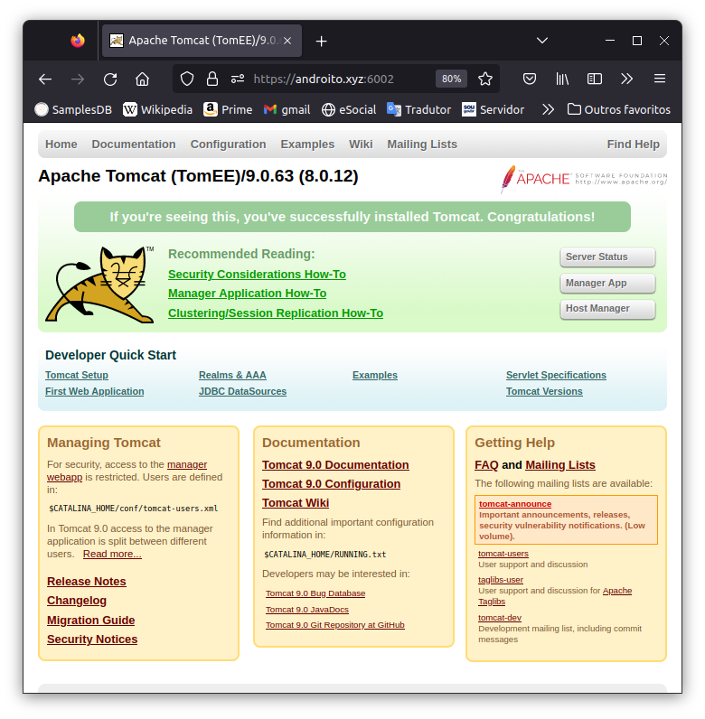

# ExomaDB: sistema web de banco de dados para gerenciamento de amostras de laboratório 


## Requisitos para instalação 


## Hardware 


Os requisitos básicos podem ser mínimos. Se não houver expectativa de muitos usuários conectados simultaneamente a mais simples das máquinas servirá. Caso você tenha previsão de armazenar muitos dados, então deve mensurar um tamanho de disco apropriado. Do mesmo modo, se houver necessidade de muitos usuários conectados seria recomendado uma máquina com pelo menos uns quatro processadores, senão oito processadores e 16 Gigabytes de RAM. O tamanho máximo configurado atualmente para upload de arquivos e de 2 Megabytes. Entretanto, arquivos de amostras geralmente ficam com tamanhos máximos próximos de 40 Kilobytes. 


## Sistema operacional 

Sistema operacional Linux Ubuntu, 20.04 LTS. Todas as referências de programas e comandos de instalação são referentes ao ambiente Linux. 


## Para instalar o ExomaDB você necessitará: 


1) Um usuário administrador da máquina. Não estou especificando o usuário root, mas este também pode ser utilizado. No Ubuntu utilizamos a figura do sudoer que é um tipo de usuário com privilégios administrativos. Por isto, muitos dos comandos neste tutorial usam o prefixo "sudo" no início para sinalizar ao Linux que o comando a seguir necessitará de privilégios administrativos. 


2) A instalação do TOMCAT Enterprise Edition (EE) versão 9 (https://tomee.apache.org/). É necessário baixar e instalar manualmente o tomcatee plus. Este é um controlador de aplicativos java de um servidor. Eu não necessito ensinar como instalar o TOMCAT EE porque existem diversos tutoriais na internet mostrando como proceder. Vou indicar um que aprovei neste [**LINK**](https://www.vultr.com/docs/install-apache-tomcat-on-ubuntu-20-04-39123). Este [**LINK**](https://www.vultr.com/docs/install-apache-tomcat-on-ubuntu-20-04-39123)  mostra a instalação do tomcat 10. Aqui eu chamo a sua atenção para detalhes importantes: 

- O software que você baixa via este site foi compilada com o tomcatee 9 que utilizava uma versão 9.0.63 do tomcat raiz. Faz alguns meses que a versão 9.0.63 do tomcat deixou de ser a oficial para tomcatee versão 9. Agora usam versões iguais ou superiores à versão 10 do tomcat raiz. A principal diferença está na mudança do padrão javax para o padrão jakarta de interfaces. O site de download do tomcatee explica que esta é a primeira grande mudança no tomcat em vinte anos. O site do tomcatee oferece várias possibilidades para que, de modo automático, uma aplicação seja convertida de javax para jakarta. Eu gerei uma versão com esta migração automática criando a versão 2.0 do ExomaDB. Ainda assim, pretendo fazer a transição para jakarta direto no meu código fonte por ser a solução definitiva e infalível. Por enquanto, suas opções são utilizar a versão 1.0 do ExomaDB com tomcatee que usa um tomcat raiz inferior ao 10  ou utilizar a versão 2.0 do ExomaDB convertida automaticamente de javax para jakarta, mas agora utilizando a última versão do tomcatee versão 9. Acredito que a versão 2.0 do ExomaDB com o tomcatee plus versão 9 é o modo mais fácil de prosseguir.

- O tomcat original, ao qual referencio agora como raiz, e o tomcat EE são diferentes. O tomcat raiz possui mais versões que tomcat EE, inclusive não há uma versão 10 do tomcat EE. O mesmo procedimento de instalação do tomcat raiz também serve para o tomcat EE. Inclusive, o tomcat EE é construído a partir das fontes do tomcat raiz. É importante ser a versão 9 porque uso o java versão 11 para compilar todo o meu código. A versão 8 do tomcat é para quem ainda utiliza o java versão 8. 


Após uma instalação bem-sucedida do tomcat é possível acessar a sua página padrão para controle de aplicativos escritos em java.  


 


Geralmente a instalação do tomcatee é testada com a chamada localhost:8080, padrão de instalação do tomcat. Eu mudei o padrão para não ser vítima de 'espionagem' na web: muita gente fica monitorando servidores tomcat na rede na porta 8080 e por isto eu mudei. Esta mudança também é algo que se aprende em tutorias da internet. Outro detalhe do meu servidor é que ele implementa o protocolo https. Isto também se aprende em tutorias da internet e é um pouco cheio de detalhes. Entretanto, sem um protocolo https outros podem suspeitar do seu site e sequer o acessam. Perceba que estes dois tópicos, mudança da porta de acesso e protocolo https, não são necessários para o ExomaDB funcionar, mas inspiram confiança e tranquilidade para os usuários e administradores do sistema. Digamos que são itens opcionais muito desejados. 


3) A instalação do "openjdk-11-jre", obtida via o comando: 
```bash 

sudo apt install openjdk-11-jre 
``` 

Este é o modulo executável do java 11. Não há necessidade em baixar as bibliotecas de desenvolvimento do openjdk porque você vai apenas executar os códigos compilados que vou fornecer. 


4) A instalação do sistema gerenciador de bancos de dados postgres, versão 10 ou superior. No Linux realizamos a instalação com o comando: 
```bash 

sudo apt install postgresql 
``` 


5) Precisamos ter acesso ao usuário administrador de banco de dados do postgres sem necessariamente fazermos o login no usuário postgres do sistema operacional (SO). Para isto, temos que alterar a senha do usuário postgres do SO: 
```bash 

sudo passwd postgres 
``` 

Uma vez alterada a senha precisamos logar com o usuário postgres no SO: 
```bash 

su postgres 
``` 

Como o usuário postgres do SO, precisamos alterar a senha do usuário de banco de dados do postgres. Perceba que são usuários distintos com o mesmo nome: o usuário do SO e o do SGBD se chamam postgres. Para alterar a senha do usuário postgres do SGBD, primeiro chamamos o comando psql: 
```bash 

psql 
``` 

Como estamos logados com o usuário do SO que administra o SGBD não é solicitada nenhuma senha. Uma vez aberta a interface do psql podemos alterar a senha do usuário postgres do SGBD com o comando: 

```sql  

postgres=# ALTER USER postgres WITH ENCRYPTED PASSWORD 'topsecret1'; 

postgres=# \q 

``` 

Se o comando acima foi bem-sucedido, você pode fechar a sessão do SGBD e do seu usuário postgres do SO: 

```bash 

exit 
``` 

... voltando a seu usuário administrador do SO Ubuntu. Agora você consegue executar o comando abaixo sem necessariamente estar no usuário postgres do SO: 

```bash 

psql -h localhost -U postgres -p 5432 -c "\du" 
``` 

O comando acima deve retornar os usuários cadastrados no seu banco de dados. Como você acabou de instalar o postgres deve haver apenas o usuário "postgres" no seu SGBD. No meu caso há um usuário extra que criei para administrar o ExomaDB de nome "exomaadm". Agora você vai criar este usuário também porque o ExomaDB conta com a existência deste usuário para fins de administração e acesso ao banco de dados. 


6) Para criar o usuário administrador do banco de dados ExomaDB de nome "exomaadm" conecte-se ao banco de dados com o usuário postgres:  

```bash 

psql -h localhost -U postgres -p 5432 
``` 


Agora criamos o novo usuário: 

```sql 

postgres=# CREATE USER exomaadm WITH ENCRYPTED PASSWORD 'topsecret2'; 

postgres=# ALTER USER exomaadm CREATEDB; 
``` 


Até aqui você conseguiu fazer a configuração sem ter acesso aos códigos que necessita para instalar o sistema. Daqui em diante você precisa ter o software em mãos para continuar. As etapas que restam são: 


7) Criar o esquema do banco de dados a partir do arquivo "exoma.schema" 

```bash 

createdb -h localhost  -p 5432 -U exomaadm exoma 

psql -h localhost  -p 5432 -U exomaadm  exoma  -f exoma.schema 
``` 

8) Copiar o arquivo "exoma.war" na pasta /opt/tomcat/webapps e reiniciar o tomcatee para este proceder com a instalação. 

```bash 

sudo cp exoma.war /opt/tomcat/webapps 

sudo systemctl restart tomcat 
``` 


9) Alteração da senha de banco do usuário exomaadm que está no arquivo descompactado pelo tomee. Use seu editor de texto preferido para localizar e alterar a linha:  

```text 

<property name="hibernate.connection.password">topsecret2</property> 
``` 

no arquivo /opt/tomcat/webapps/exoma/WEB-INF/classes/hibernate.cfg.xml. A primeira vez que reiniciamos o tomcat foi para que ele encontrasse e descompactasse o arquivo war. Agora faremos a reinicialização para ficar valendo a nova configuração da senha para o usuário exomaadm: 

```bash 

sudo systemctl restart tomcat 
``` 

E pronto! Agora você deve conseguir acessar o banco de dados. Existe um usuário 'admin' com a senha 'exomaadm' que vai te permitir logar no sistema. Após o seu primeiro login, por favor, troque a senha do usuário 'admin'. 


## Iniciando o uso 


O banco de dados que você instalou não possui dado algum, exceto os dados do usuário administrador e suas respectivas permissões de acesso a telas. Neste caso o usuário admin está com acesso a todas as telas do sistema. No seu primeiro acesso você deve notar um atraso de aproximadamente cinco segundos entre o clique no botão de login e a resposta do sistema. Isto é normal e só acontece no momento do login porque o sistema está te autenticando e sendo carregado no seu computador para um primeiro uso. Após o login o restante das telas é exibido quase que instantaneamente.  


O mais afoito dos usuários do ExomaDB pode imaginar o cadastro imediato de amostras no sistema. Entretanto, antes que alguma amostra seja cadastrada no sistema, é necessário fazer o cadastro de tabelas periféricas. As tabelas periféricas são populadas por meio dos menus do sistema de nome 'Projeto' e 'Exame'. Ou seja, cada amostra pertencerá a algum projeto e estará sujeito ao diagnóstico por parte de algum exame. Sem a existência de algum conteúdo nas tabelas de projetos e exames, via os menus do sistema, amostra alguma conseguirá ser cadastrada no sistema. Além disto, cada amostra é necessariamente associada a um participante. Por isto, os dados de participantes também podem ser considerados periféricos no tocante a amostras e devem ser cadastrados previamente também.  


Também chamo a atenção para a tela de Report (Relatórios). Quando há pouco ou dado nenhum cadastrado no sistema a tela de relatórios é exibida com menus de seleção de opções vazios ou com apenas uma ou duas opções, depende de quantos cadastros você fez. À medida que o sistema é mais populado, com diferentes dados, esta tela aumenta suas opções de pesquisa. Em resumo, esta tela exibe as opções cadastradas no sistema e, por isto, por exemplo, você não encontrará todas as cidades do estado ou do país disponíveis para seleção, apenas as cidades ou estados que foram cadastrados via os participantes cedentes das amostras. 


Espero que aproveite o ExomaDB. Acredito que ele vai te ajudar a organizar o seu trabalho no laboratório. 


Atenciosamente, 

Anderson Santos 

santosardr@ufu.br 
